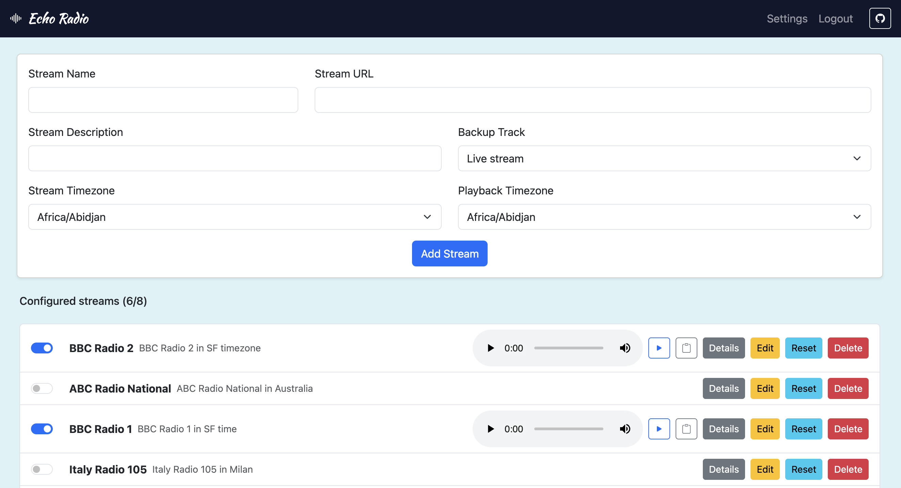

# EchoRadio

## Listen to international radio in your local timezone

Wish you could wake up to your favorite New York radio station breakfast show and go to sleeping listening to Australian talk radio? I created this app to help you do just that. Add internet streams, choosing the timezone they are broadcast in and the timezone you want to listen in. EchoRadio will record the stream, and then rebroadcast matching the content to your local time.

## 🚀 Features

- Dockerized for deployment with Docker Compose or Swarm
- Web interface to manage and play audio streams
- Secure admin authentication (optional)
- Supports multiple streams

## ⚙️ Setup

You can either build from source, or it's much easier to deploy the existing Docker Hub image.

1. Deploy using image from [Docker Hub](https://hub.docker.com/repository/docker/simonsecuritypedant/echoradio/general)
2. By default, access the web interface at http://host:8080, and the Icecast instance at http://host:8000. These can be fine if you are just listening on your local network. However, if you want to stream over the Internet. Highly recommend using Cloudflare tunnels to expose services. (I will create an instruction video soon)
3. When accessing for the first time, set passwords for Icecast admin and streaming. Also, set Icecast hostname, protocol and port for what is the Internet accessible address. These values will be used in the web interface. You can also set an admin password so that you can share the URL with others to listen.
4. Add streams, by default you can add 3. But use settings to increase as you need.

## 📝 License

MIT License

## ✨ Credits

Built by [Simon Thorpe](https://github.com/simonthorpe)  
Inspired by the power of community broadcasting.

## Building docker image

### Local dev environment

docker build --build-arg FLASK_ENV=development . -t echoradio
docker compose -f docker-compose-dev.yaml up -d

### Docker hub

docker buildx build \
  --platform linux/amd64,linux/arm64 \
  -t simonsecuritypedant/echoradio:latest \
  --push .